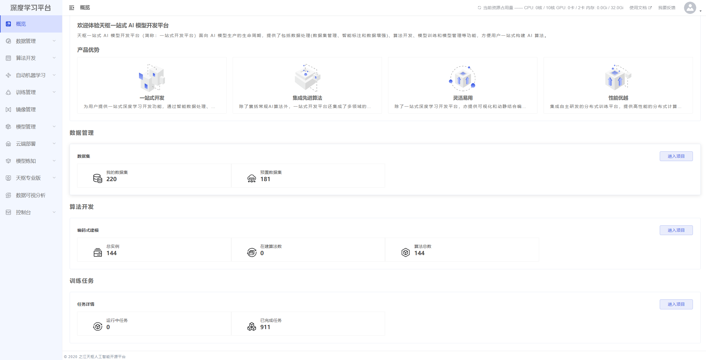
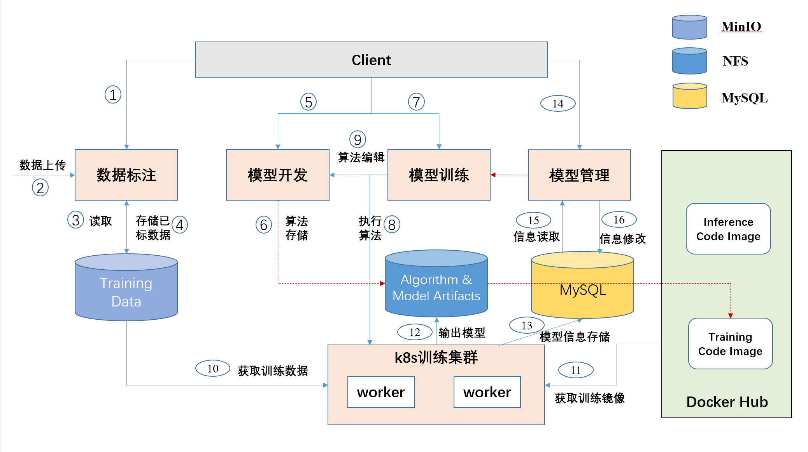

<p align="center">
  <a href="http://tianshu.org.cn">
    
  </a>
</p>

<h1 align="center">之江天枢人工智能开源平台</h1>


**之江天枢人工智能开源平台**是由之江实验室牵头，联合国内顶尖科研力量共同打造的国产化自主可控的人工智能开源平台。平台面向人工智能研究中的数据处理、算法开发、模型训练、算力管理和推理应用等各个流程的技术难点，研发了包括**一站式算法开发平台、高性能分布式深度学习框架、先进算法模型库、视觉模型炼知平台、数据可视化分析平台**等一系列平台及工具，在模型高效分布式训练、数据处理和可视分析、模型炼知和轻量化等技术上形成独特优势，目前已在产学研等各领域近千家单位及个人提供AI应用赋能。


## 平台优势

* **一站式开发**：为用户提供一站式深度学习开发功能，通过智能数据处理、便利的模型开发和模型训练，打通深度学习全链路；

* **集成先进算法**：除了囊括常规AI算法外，之江天枢还集成了多领域的独家算法，提供业界领先性能。

* **灵活易用**：除了一站式深度学习开发平台，亦提供可视化和动静结合编码方式，调试灵活，小白亦可快速上手。

* **性能优越**：集成自主研发的分布式训练平台，提供高性能的分布式计算体验，节省训练成本和训练时间。

## 页面预览



## 目录结构
```
├── dubhe_data_process            数据处理服务
├── dubhe-server                  后端服务 
├── dubhe-visual-server           可视化服务 
├── webapp                        前端服务 
├── dataset-util                  数据集上传脚本服务
├── distribute-train-operator     分布式训练OP服务
├── tianshu_serving               天枢serving服务
├── model_compress                模型压缩服务
├── model_measuring               模型度量服务
├── model-converter               模型转换服务
```

## 技术架构


## 反馈问题

- [在线社区](http://www.aiiaos.cn/index.php?s=/forum/index/forum/id/45.html)
- 钉钉交流群


## 许可证书
本项目的发布受[Apache 2.0 license](./LICENSE)许可认证。
