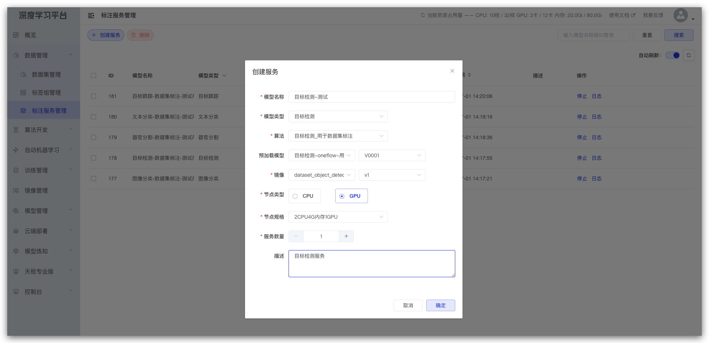
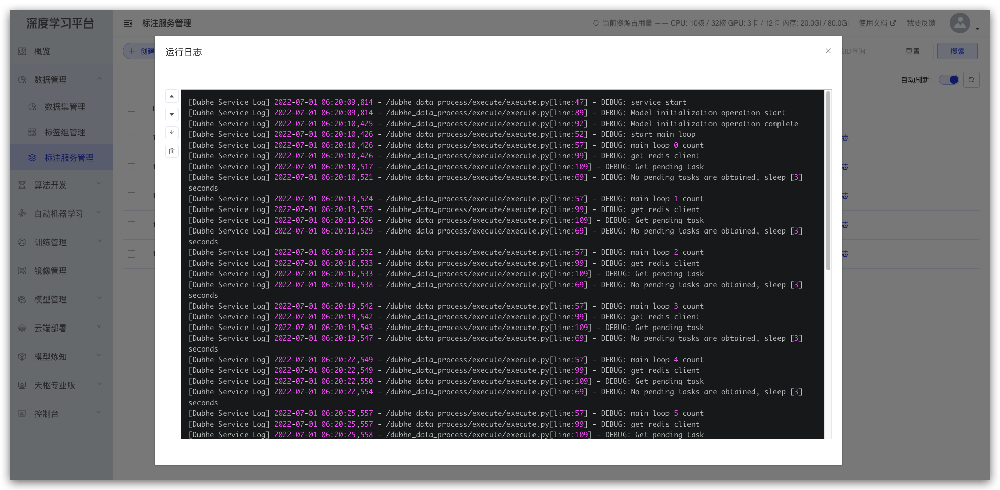

# 之江天枢-算法端

**之江天枢一站式人工智能开源平台**（简称：**之江天枢**），包括海量数据处理、交互式模型构建（包含Notebook和模型可视化）、AI模型高效训练。多维度产品形态满足从开发者到大型企业的不同需求，将提升人工智能技术的研发效率、扩大算法模型的应用范围，进一步构建人工智能生态“朋友圈”。

## 算法部署

源码部署
准备环境

ubuntu系统 版本18.04及以上
python 3.7+
redis  5.0+
oneflow 框架

## 下载源码

```shell
$ https://gitee.com/zhijiangtianshu/Dubhe.git
```

## 进入项目根目录

```shell
$ cd dubhe_data_process
```

## 启动算法 (参数指定需要启动的算法)

```shell
$ python main.py imgprocess False 127.0.0.1,6379,0,1234
```
>  参数说明
* imgprocess 表示启动的算法
* False 表示是否需要GPU
* 127.0.0.1,6379,0,1234分别表示redis的ip、端口、database、密码

具体部署流程请参考 http://tianshu.org.cn/?/course 中文档**部署数据处理算法**

## 快速上手：

### 代码结构：

```
.
├── README.md
├── algorithm                             预置算法程序目录
│   ├── image-classification              图像分类
│   ├── imgprocess                        数据增强
│   ├── lung-segmentation                 医学分割
│   ├── object-detection                  目标检测
│   ├── ofrecord                          ofrecord转换
│   ├── text-classification               文本分类
│   ├── track                             目标跟踪
│   └── videosample                       采样
├── common                                基础工具
│   ├── __init__.py
│   └── util
│       ├── __init__.py
│       └── public
│           ├── RedisUtil.py              redis链接操作工具类
│           ├── __init__.py
│           ├── json_util.py              json处理工具类
│           ├── logger_util.py            日志打印工具类
│           └── select_gpu.py             gpu工具类(主要用于需要gpu的算法启动时切换gpu卡槽所用)
├── execute 
│   ├── execute.py                        具体任务处理类
│   └── lua_script.py                     操作任务操作脚本
├── docker-image                                 预置算法镜像
│   ├── image-classification
│   │   ├── Dockerfile
│   │   ├── Python-3.7.4.tgz
│   │   ├── README.md
│   │   └── sources.list
│   ├── imgprocess
│   │   ├── Dockerfile
│   │   ├── README.md
│   │   ├── imgprocess-hpa.yaml
│   │   ├── imgprocess.yaml
│   │   └── sources.list
│   ├── lung-segmentation
│   ├── object-detection
│   ├── ofrecord
│   ├── text-classification
│   ├── truck
│   └── videosample
├── log
│   └── log_2022-05-26.txt
└── main.py                               算法启动主入口
```

### 程序执行流程说明


> 其中初始化模型和调用推理接口两个方法需要满足系统要求

* 文件要在算法根目录下且名称要固定为inference.py
* 方法名称要固定为load(记载模型方法)及inference(推理方法)

如下案例：
```python
import annotation as ann

def load():
    """
        加载
    """
    print("加载")
    ann._init()

def inference(task):
    """
        推理
    """
    return ann.execute(task)
```

### 算法接入：


#### 编写算法程序

编写算法程序需要注意：
* 需要在算法推理接口前增加inference.py文件来实现模型的加载以及对外推理服务的入口
* 如果算法需要加载模型权重，则需要把模型权重放到根目录下的model目录中
* 算法程序推理接口入参以及推理结果需要满足系统要求

> 目标检测

推理参数

```json
{
  "files": [
    {
      "datasetId": 1,
      "id": 1,
      "name": "000000034139_ts48PFzrS0bz",
      "url": "/nfs/dubhe-prod/dataset/1/origin/000000034139_ts48PFzrS0bz.jpg"
    }
  ],
  "labels": [
    "person",
    "bicycle",
    "car"
  ],
  "taskId": 1
}
```

推理结果

```json
{
	'reTaskId': 'e3cd424c-5a7a-4278-9636-6d0d5f16b713',
	'annotations': [
    {
      'id': 1,
      'annotation': '[{"area": 36354.28243389582, "score": 0.9814451932907104, "iscrowd": 0, "category_id": "keyboard", "bbox": [74.66009259223938, 372.6794943213463, 272.36245572566986, 133.477583527565], "segmentation": [[74.66009259223938, 372.6794943213463, 347.02254831790924, 372.6794943213463, 347.02254831790924, 506.1570778489113, 74.66009259223938, 506.1570778489113]]}]'
	  }
  ]
}
```

> 图像分类

推理参数

```json
{
  "files": [
    {
      "datasetId": 2,
      "id": 2,
      "name": "000000001584_tslXA6yhxzEW",
      "url": "/nfs/dubhe-prod/dataset/2/origin/000000001584_tslXA6yhxzEW.jpg"
    }
  ],
  "labels": [
    "tench, Tinca tinca",
    "goldfish, Carassius auratus",
    "great white shark, white shark, man-eater, man-eating shark, Carcharodon carcharias",
    "tiger shark, Galeocerdo cuvieri"
  ],
  "taskId": 2
}
```

推理结果

```json
{
	'annotations': [{
		'id': 2,
		'annotation': '[{"category_id": "meat loaf, meatloaf", "score": 0.8088632822036743}]'
	}]
}
```

> 文本分类

推理参数

```json
{
  "files": [
    {
      "datasetId": 1,
      "id": 1,
      "name": "000000034139_ts48PFzrS0bz",
      "url": "/nfs/dubhe-prod/dataset/1/origin/000000034139_ts48PFzrS0bz.jpg"
    }
  ],
  "labels": [
    "person",
    "bicycle",
    "car"
  ],
  "taskId": 1
}
```

推理结果

```json
{
  "classifications": [{"annotation": "[{"category_id": "negative", "score": 0.7944}]", "id": 24340856}]
}
```

> 器官分割

推理参数

```json
{
    "annotationPath": "/nfs/dubhe-open-dev/dataset/dcm/346/annotation",
    "dcms":
    [
        "/nfs/dubhe-open-dev/dataset/dcm/346/origin/000144.dcm",
        "/nfs/dubhe-open-dev/dataset/dcm/346/origin/000145.dcm",
        "/nfs/dubhe-open-dev/dataset/dcm/346/origin/000146.dcm",
        "/nfs/dubhe-open-dev/dataset/dcm/346/origin/000147.dcm"
    ],
    "medicineFileIds":
    [
        "29756",
        "29757",
        "29758",
        "29759"
    ],
    "taskId": "5130"
}
```

推理结果

```json
[
  {
    "id": "29256", 
    "annotations": [{"type": 0, "annotation": []}]
  }
]
```

> 目标跟踪

推理参数

```json
{
    "path": "/nfs/dubhe-open-dev/dataset/5359/versionFile/V0001",
    "images":
    [
        "GE44-S-w5m_ts2UPN6pQv2__1.jpg",
        "GE44-S-w5m_ts2UPN6pQv2__101.jpg"
    ],
    "labels":
    [
        "81",
        "82"
    ]
}
```

推理结果

无。目标跟踪算法会直接修改标注文件写入实体ID。


#### 算法程序上传

登录天枢平台，在算法管理和模型管理中上传开发的算法程序（需要把算法和模型分开打包为压缩包，并且压缩包解压后文件结构和原始一样不能存在增加多余层级）。

#### 镜像上传

用户需要根据自己的算法环境编写Dockfile并制作镜像（如果上传系统提供算法对应镜像，则可以在docker-image中找到对应Dockerfile），完成后把镜像保存为压缩文件并通过天枢平台镜像管理进行上传即可。

#### 算法部署

登录天枢平台打开`数据管理`->`标注服务管理`页面，点击`创建服务`按钮，在弹窗中根据需要填写以及选择对应算法、模型、镜像等，选择完成后点击`确定`即可，此时刷新列表页面，便可以看到刚才创建的服务，可以根据需要点击对应按钮

<center>
  <div style="display: inline-block"> 1- 创建模型服务</div>
  
</center>


<center>
  <div style="display: inline-block"> 1- 查看服务日志</div>
  
</center>